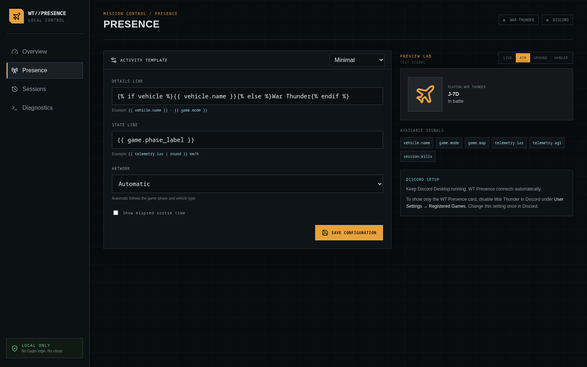

# WT Presence

> Fight the battle. Broadcast your signature.

Privacy-first, configurable Discord Rich Presence for War Thunder. WT Presence reads the game's loopback telemetry, renders it through editable activity templates, and talks to Discord through its local IPC socket. No Gaijin login. No cloud account.

WT Presence is an unofficial project and is not affiliated with Gaijin Entertainment.



Windows 10/11 x64 is the first supported target. The project is in beta.

## What works today

- Automatic offline, hangar, loading, and battle detection.
- Live vehicle, mode, map, speed, altitude, and crew data when War Thunder exposes it.
- Editable Discord details and state templates.
- Air, ground, and hangar fixtures in Preview Lab — no running game or Discord connection required.
- Optional elapsed sortie time and bundled artwork with automatic phase and vehicle selection.
- Local session summaries stored in SQLite.
- A loopback-only dashboard protected by a per-process token.
- A user-local Windows installer and tray integration.

Combat-event attribution and [Combat Signature](docs/design/combat-signature.md) are designed but not implemented yet. StatShark is not a runtime dependency; possible career-stat integration remains a future optional adapter.

## Install on Windows

Download `WT-Presence-Setup.exe` from the [latest beta release](https://github.com/janiespalem/wt-presence/releases). The installer is per-user and does not require administrator access.

Early builds are unsigned, so Windows SmartScreen may show an unknown-publisher warning.

## Connect Discord

WT Presence includes its Discord identity and artwork. No Application ID, Developer Portal setup, or asset uploads are required.

1. Keep Discord Desktop running.
2. Start WT Presence and launch War Thunder. The Discord connection is automatic.
3. If you want WT Presence to be the only visible activity card, disable War Thunder in Discord under **User Settings → Registered Games**. This is a one-time setting you change in Discord.

The dashboard's **Presence** editor lets you choose **Automatic**, **Default**, **Air**, **Ground**, **Naval**, or **Hangar** artwork. Automatic follows the current game phase and vehicle type. Preview Lab works without the game or Discord, so templates can be edited and tested offline.

## Templates

The bundled editor supports strict MiniJinja templates. Available values include:

```text
vehicle.name          game.phase_label
vehicle.kind          game.mode
telemetry.ias         game.map
telemetry.agl         session.kills
telemetry.crew_current
```

Example:

```jinja
{{ vehicle.name }} · {{ game.mode }}
{{ telemetry.ias | round }} km/h · {{ telemetry.agl | round }} m
```

Invalid variables and Discord's 128-character field limit produce visible diagnostics instead of silently publishing a broken activity.

## Privacy boundary

```text
War Thunder :8111  ──>  WT Presence  ──>  Discord local IPC
                              │
                              └──> local settings and SQLite sessions
```

WT Presence binds its dashboard to `127.0.0.1`, accepts telemetry URLs only on loopback hosts, and never asks for Gaijin credentials. Session data stays on the machine unless the user exports or shares it.

## Run from source

Requirements: Rust 1.95, Node.js 22+, npm, War Thunder, and Discord Desktop.

```sh
cd web
npm ci
npm run build
cd ..
cargo run --release
```

The dashboard opens automatically. War Thunder must be running for live telemetry to appear.

## Verify a checkout

```sh
cd web
npm ci
npm run build
cd ..
cargo fmt --check
cargo clippy --all-targets --all-features -- -D warnings
cargo test --all-features
```

CI runs the same frontend build, formatting, lint, and test checks on Ubuntu and Windows.

## License

[Mozilla Public License 2.0](LICENSE)
